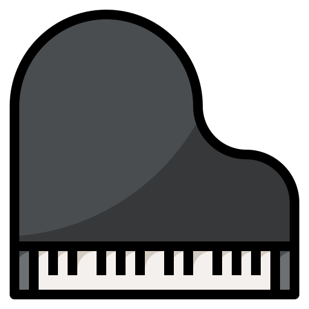

<h1 align="center">Portfoliano</h1>

**Portfoliano** is my web page portfolio that showcases all songs I taught myself on the piano.

It is available through this repository's GitHub Pages: [https://cide0.github.io/portfoliano/](https://cide0.github.io/portfoliano/)

## Current Features

- Switch between the **via Tutorial** and **via Sheet Music** pages:
  - **via Tutorial**: Here you can find all songs I learned through tutorials.
  - **via Sheet Music**: Here you can find all songs I can play by their sheet music.
- Each song contains the following information:
  - Title
  - Artist
  - Upload Date
  - Youtube video of me playing the song
  - Spotify link to the song (if available)
- Search bar to search for songs by title or artist.
- Sorting toggle to display the songs by upload date in ascending or descending order.
- Fun animations! :smile:

## Setup

If you want to run this project locally, you can do so by simply opening the `index.html` file in your browser.
